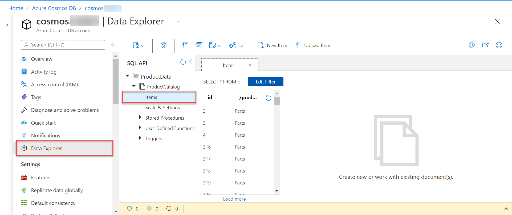

# Query Azure Cosmos DB

In this exercise, you'll see how to use the Data Explorer in the Azure portal to run queries.


### Task 1: Query documents with the SQL API using Data Explorer
--------------------------------

1.  Return to the Azure portal, and go to your Cosmos DB account.

2.  On the Overview page for the account, select Data Explorer. On the Data Explorer page, expand the ProductData database, expand the ProductCatalog container, and then select Items. Verify that the Items pane contains a list of products.

    

3.  Select the item with ID 316. A JSON document containing the details for product 316 should appear in the right-hand pane.

    

4.  In the toolbar, select New SQL Query.

    

5.  In the Query 1 pane, enter the following query, and then select Execute Query. This query returns the name, color, listprice, description, and file name of the image for each model of mountain bike that Contoso make. The query should return 32 documents.

    ```
    SELECT p.productname, p.color, p.listprice, p.description, p.images.thumbnail
    FROM products p
    WHERE p.productcategory.subcategory = "Mountain Bikes"

    ```

    
