# Manage Azure Blob storage

In this exercise, you'll learn how to create and manage blobs, and the containers that hold them. You can do this using the Azure portal, or using the Azure CLI or Azure PowerShell from the command line.


### Task 1: Using Azure portal
--------------------------------
#### Create an Azure Storage container:

In an Azure storage account, you store blobs in containers. A container provides a convenient way of grouping related blobs together, and you can organize blobs in a hierarchy of folders inside a container, similar to files in a file system on disk.

You create a container in an Azure Storage account. 

1.  In the Azure portal, in the left-hand navigation menu, select Home

    

2.  On the Home page, select Storage accounts, and then select the storage account present in the page that starts with the name **storage**. Copy the storage account name into a notepad for later tasks.

    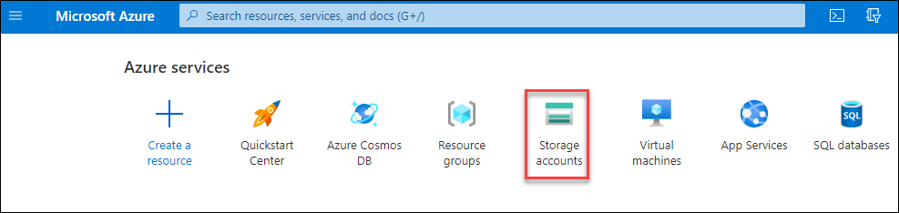

3.  On the Storage Account page, under **Data storage**, select **Containers**. On the Containers page, select **+ Container** to create a new container.

    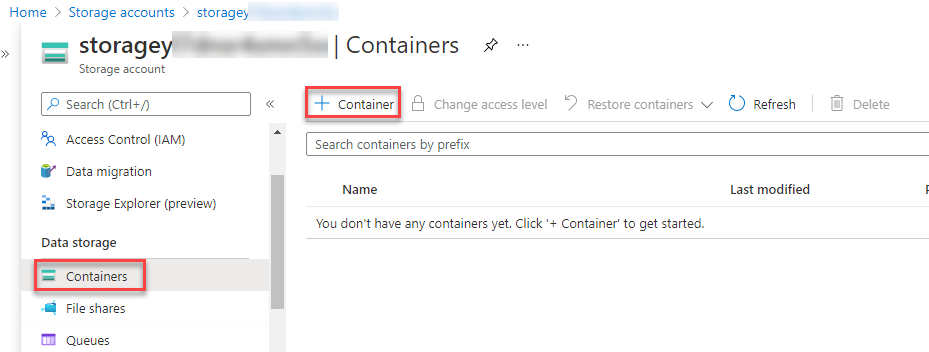

4. On the new container create page, provide name as **images** and select **blob** in **Public access level** dropdown. Click on create.

    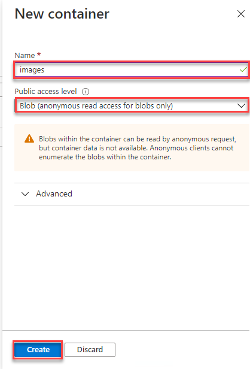

#### Upload a blob to Azure Storage:

After you've created a container, you can upload blobs. Depending on how you want to organize your blobs, you can also create folders in the container.

1. In the Azure portal, in the left-hand navigation menu, select Home

    

2. On the Home page, select Storage accounts, and then select the storage account present in the page that starts with the name **storage**.

    

3. On the Storage Account page, under **Data storage**, select **Containers**. On the Containers page, select **images**.

    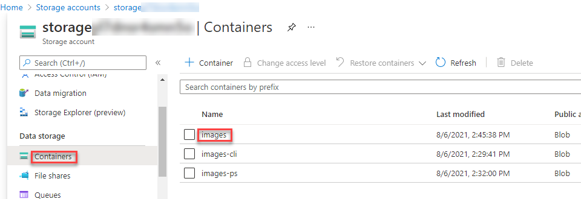
    
4. Now click on **Upload**, it will open file upload window, select file icon then browse to desktop and go to **lab** folder and it's subfolder **images** then select a file and upload it.

    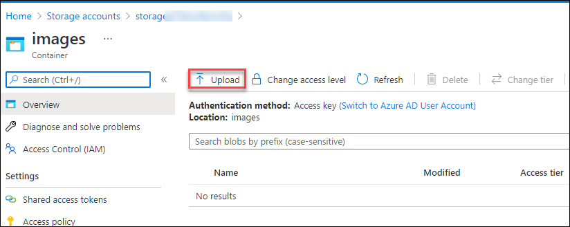   
         

5. The Advanced drop-down section provides options you can modify the default options. For example, you can specify the name of a folder in the container (the folder will be created if it doesn't exist), the type of blob, and the access tier. The blob that is created is named after the file you uploaded. Click on Upload

    

#### List the blobs in a container:

After you've uploaded files to a container, you can view them in th container folder.

1. On the Storage Account page, under **Data storage**, select **Containers**. On the Containers page, select **images**.

    
    
2. The uploaded images can be shown here

    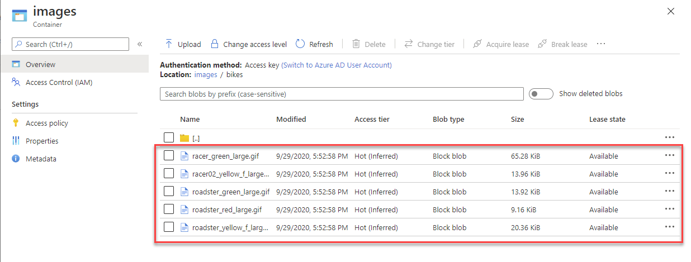   

#### Download a blob from a container:

1. On the Storage Account page, under **Data storage**, select **Containers**. On the Containers page, select **images**.

    
    
2. In the list of files select any file, it will open a window with details of the file which is selected. Now click on **Download** to download the file.    

    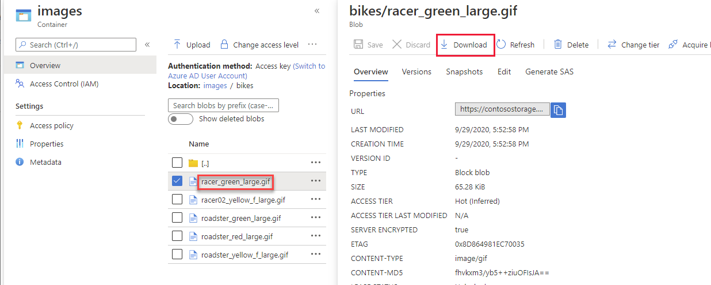

#### Delete a blob from a container

Deleting a blob can reclaim the resources used in the storage container. However, if you've enabled the soft delete option for the storage account, the blob is hidden rather than removed, and you can restore it later.

1. On the Storage Account page, under **Data management**, select **Data protection**. Now select check box **Enable soft delete for blobs** to enable soft delete on blobs

    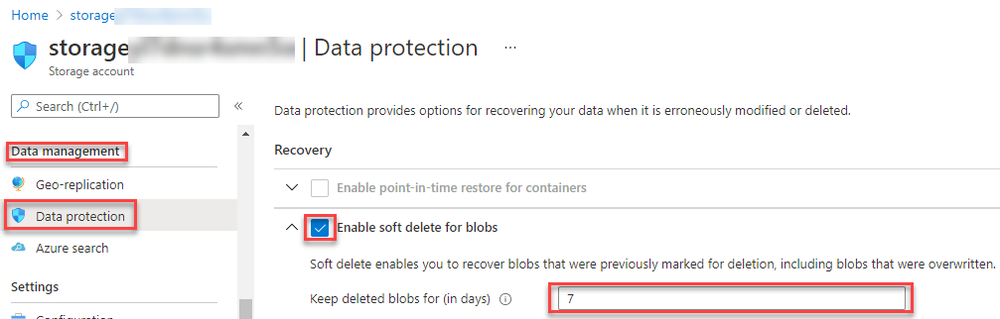

2. Now on the Storage Account page, under **Data storage**, select **Containers**. On the Containers page, select **images**.

    
    
3. In the list of files select any file, it will open a window with details of the file which is selected. Now click on **Delete** to delete the file.    

    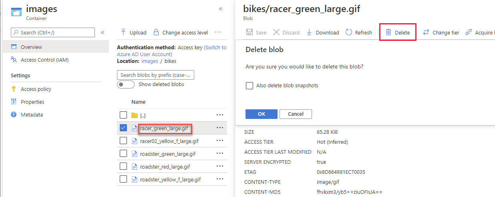

4. Now click on **Show deleted blobs** to view the deleted files.

    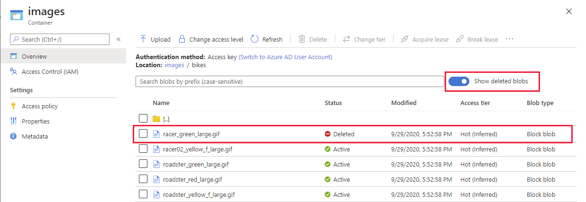
    
#### Delete an Azure Storage container:

1. On the Storage Account page, under **Data storage**, select **Containers**. On the Containers page, select **images** then click on **Delete**.

    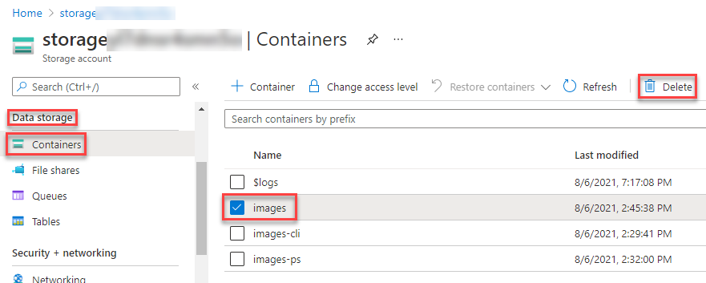
    
### Task 2: Using Azure CLI
--------------------------------   

#### Create an Azure Storage container:

1. In the Azure portal, on the left-hand navigation menu select Home and scroll down for Navigate menu and select **Resource Group**. Copy the name of the Resource Group into a notepad for later tasks.

   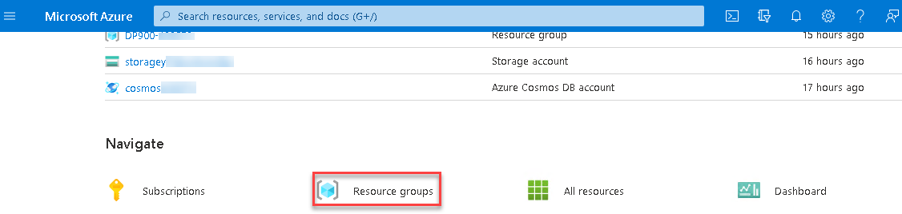
      

2. open Cloud Shell window and it will be your first time opening cloud shell and will be asked to enter bash or powershell,Select **bash** and then select **Show advanced settings**.

   
   
   

3. You have to create a storage account to run the bash commands and Select Use existing under Resource Group then select DP900-deploymentID and enter unique name for storage account name and Enter unique name and then click on **Create Storage**.

   

4. Run the following commands by replacing storage account name(including the <>) and Resource-group(including the <>) with the name of the storage account name and resource group name you copied into notepad in the earlier steps and then run the command and after the command is run you will see similar outputs as shown in image :

     ```
        az storage container create \
          --name images-cli \
          --account-name <storage account name> \
          --resource-group <Resource-group> \
          --public-access blob
     ```
   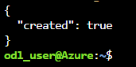

#### Upload a blob to Azure Storage:

1. After you've created a container, you can upload blobs by running the following commands. In the second command Replace storage account name(including the <>) with the name of the storage account name you copied into notepad in the earlier steps and then run the command and after the command is run you will see similar outputs as shown in image :

     ```
        git clone https://github.com/MicrosoftDocs/mslearn-explore-non-relational-data-stores-azure.git lab

        cd lab

        az storage blob upload \
          --container-name images-cli \
          --account-name <storage account name>  \
          --file "/home/odl_user/lab/images/racer_black_large.gif" \
          --name "bikes\racer_black"
     ```
   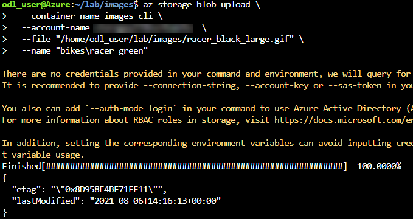

2. To upload a bulk files at a time use the following command. Replace storage account name(including the <>) with the name of the storage account name you copied into notepad in the earlier steps and then run the command and after the command is run you will see similar outputs as shown in image :

     ```
      az storage blob upload-batch\
        --account-name <storage account name>\
        --source '/home/odl_user/lab/images/'\
        --pattern '*.gif'\
        --destination 'images-cli'
     ```

   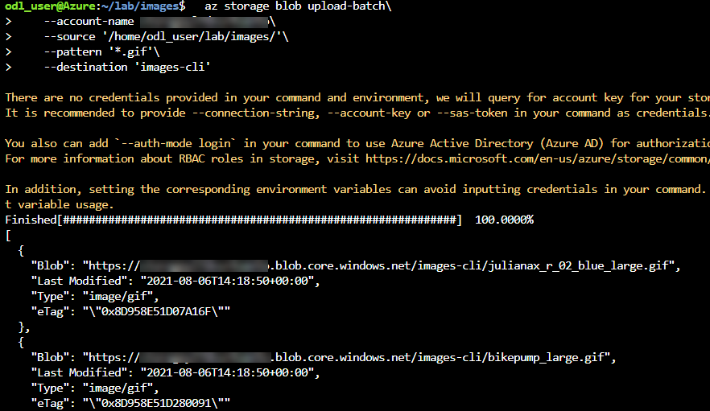
   
#### List the blobs in a container:

1. After you've uploaded blobs to a container, you can view the blobs in a container with the following command. Replace storage account name(including the <>) with the name of the storage account name you copied into notepad in the earlier steps

     ```
        az storage blob list \
          --account-name <storage account name> \
          --container-name "images-cli"
     ```
#### Download a blob from a container:
1. After you've uploaded blobs to a container, you can download the blobs in a container with the following command. Replace storage account name(including the <>) with the name of the storage account name you copied into notepad in the earlier steps

     ```
        az storage blob download \
          --container-name images-cli \
          --account-name <storage account name> \
          --file "racer_black_large.gif" \
          --name "bikes\racer_green"
     ```  
   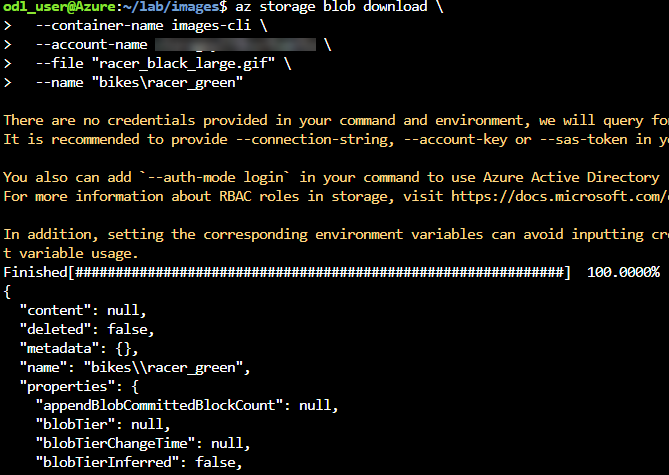

#### Delete a blob from a container

1. After you've downloaded blobs from a container, you can delete the blobs from a container with the following command. Replace storage account name(including the <>) with the name of the storage account name you copied into notepad in the earlier steps

     ```  
        az storage blob delete \
          --account-name <storage account name> \
          --container-name "images-cli" \
          --name "bikes\racer_green"	 
     ``` 

#### Delete an Azure Storage container:

1. you can delete the container with the following command. Replace storage account name(including the <>) with the name of the storage account name you copied into notepad in the earlier steps

     ```   
        az storage container delete \
          --account-name <storage account name> \
          --name "images-cli"	 
     ```  

### Task 3: Using Azure PowerShell
--------------------------------   

#### Create an Azure Storage container:

1. In the Azure portal Cli window click on **Bash** and select **PowerShell** then click on **Confirm** to switch to powershell window as shown below.

   
   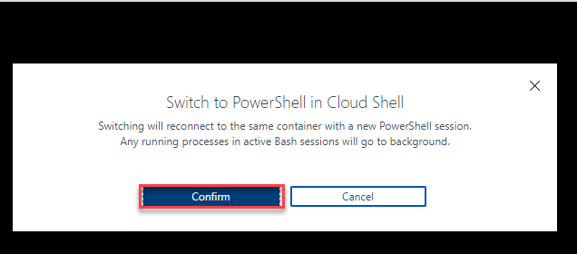   

2. Now in Azure PowerShell run the following commands by replacing storage account name(including the <>) and Resource-group(including the <>) with the name of the storage account name and resource group name you copied into notepad in the earlier steps and then run the command and after the command is run you will see similar outputs as shown in image :

     ```
        Get-AzStorageAccount `
          -ResourceGroupName "<Resource-group>" `
          -Name "<storage account name>" | New-AzStorageContainer `
            -Name "images-ps" `
            -Permission Blob
     ```
     
   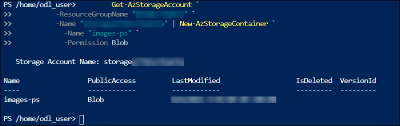
   
#### Upload a blob to Azure Storage:   
#### List the blobs in a container:
#### Download a blob from a container:
#### Delete a blob from a container
#### Delete an Azure Storage container:
