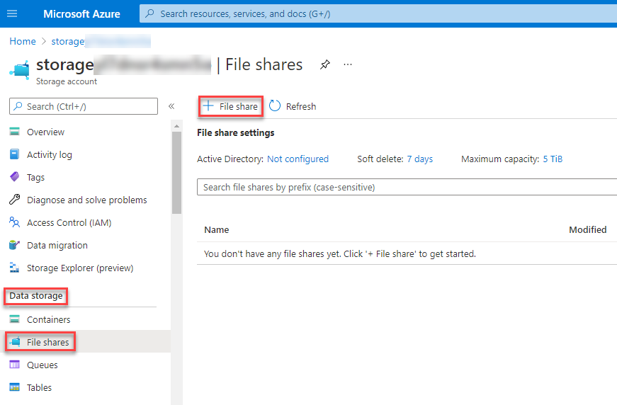
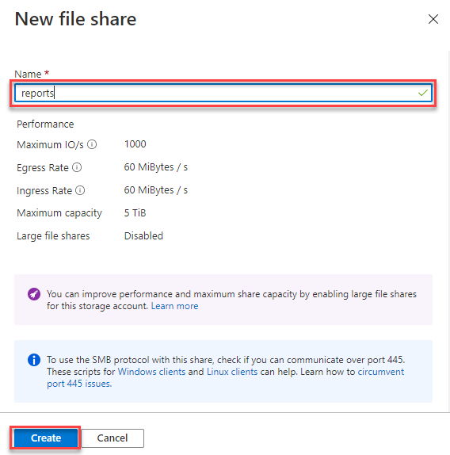
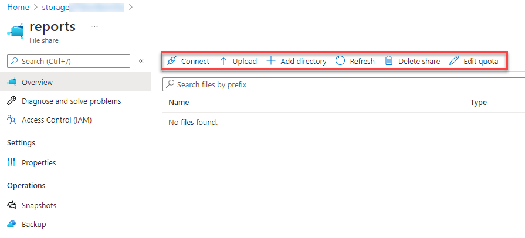
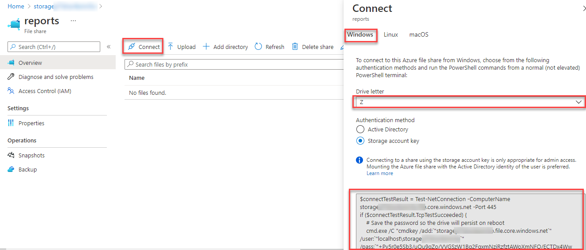
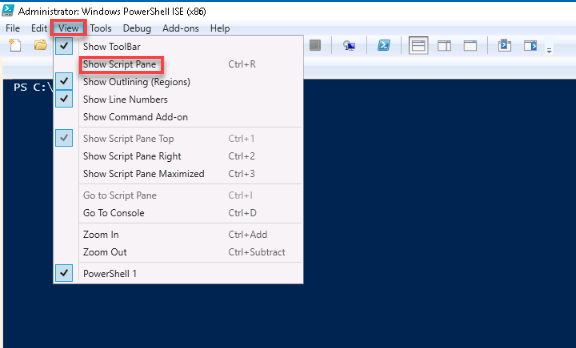
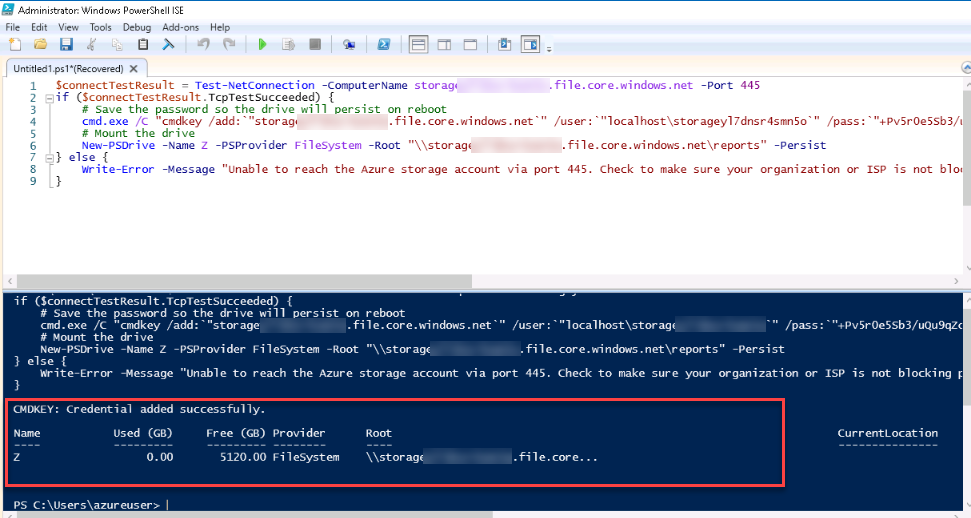
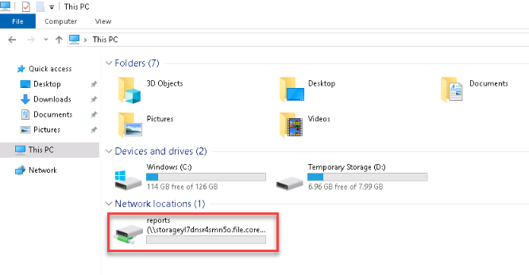

# Manage Azure File storage

In this exercise, you'll learn how to create and manage file shares, and upload and download files in Azure File storage.

### Task 1: Create a file share
--------------------------------

Microsoft provides two graphical tools you can use to create and manage file shares in Azure Storage: the Azure portal, and Azure Storage Explorer.

#### Use the Azure portal:

1. In the Azure portal, in the left-hand navigation menu, select Home

    

2. On the Home page, select Storage accounts, and then select the storage account present in the page that starts with the name **storage**. Copy the storage account name into a notepad for later tasks.

    

3. On the Storage Account page, under **Data storage**, select **File Shares**. On the File shares page, select **+ File share** to create a new file share.

    
    
4. On the New file share window give **Name** as **reports** then click on **create**.

    
    
5. After you've created a share, Click on **reports**. you can use the Azure portal to add directories to the share, upload files to the share, and delete the share. 

    

6. The Connect command generates a PowerShell script that you can run to attach to the share from your local computer. You can then use the share as though it was a local disk drive. Click on **Connect** and copy the **PowerShell** script

    
    
        
    
7. Now in LabVM go to start menu and type **Powershell ISE** in search bar, then open it.

8. Go to View and click on show script pane to open editor panel. then paste the connection string you copied and click on execute button.

     
     
         
    
9. Now open windows explorer and verify mounted drive.

       

